# Markdown

- Markdown
- [CommonMark](https://commonmark.org/)

Markdown是一种轻量级的标记语言，可用于将格式设置元素添加到纯文本文档中。Markdown 由[John Gruber](https://daringfireball.net/projects/markdown/)于2004年创建。

由于 John Gruber 对 Markdown 语法的规范描述没有明确指定语法，因此在过去 10 年中，实现方式发生了很大差异。因此，用户经常会惊讶地发现，在一个系统上以一种方式呈现的文档（例如，GitHub wiki）在另一个系统上以不同的方式呈现（例如，使用 Pandoc 转换为文档书）。

解决 Markdown 歧义和不一致的唯一方法是 [Babelmark](https://babelmark.github.io/)，它将 20+ 个 Markdown 实现的输出相互比较，以查看是否达成共识。

## 基本语法

元素|Markdown 语法
---|---
标题 | `# H1`<br />`## H2`<br />`### H3`
粗体 | `**bold text**`
斜体 | `*italicized text*`
块引用 | `> blockquote`
有序列表 | `1. First item` <br/> `2. Second item` <br/> `3. Third item`
无序列表 | `- First item` <br/> `- Second item` <br/> `- Third item` <br />
代码 | `` `code` ``
水平线 | `---`
超链接 | `[title](https://www.qq.com)`
图片 | ``

元素|Markdown 语法
---|---
表格 | `\| Syntax \| Description \|`<br/>`\| ----------- \| ----------- \|`<br/>`\| Header \| Title \|`<br/>`\| Paragraph \| Text \|`
围栏代码块 | ` ``` `<br/>`{`<br/>`"firstName": "John",`<br/>`"age": 25`<br/>`}`<br/>` ``` `
脚注 | `Here's a sentence with a footnote. [^1]`<br/><br/>`[^1]: This is the footnote.`
标题ID | `### My Great Heading {#custom-id}`
删除线 | `~~The world is flat.~~`
任务列表 | `- [x] Write the press release`<br/>`- [ ] Update the website`<br>`- [ ] Contact the media`

## 标题

```md
# 一级标题
## 二级标题
### 三级标题
#### 四级标题
##### 五级标题
###### 六级标题
```

## 段落

段落的换行

是前后要有一个以上的空行

```md
段落的换行

是前后要有一个以上的空行
```

## 字体

正常文本
*斜体文本*  
**粗体文本**  
***粗斜体文本***

```md
正常文本

*斜体文本*

**粗体文本**

***粗斜体文本***
```

<mark>标记文本</mark>

<pre>Preformatted 文本</pre>

<small>小文本</small>

这是 <sub>下标</sub>

This is <sup>上标</sup>

```md
<mark>标记文本</mark>

<pre>Preformatted 文本</pre>

<small>小文本</small>

这是 <sub>下标</sub>

这是 <sup>上标</sup>
```

## 图标

可以从 [timwhitlock](https://apps.timwhitlock.info/emoji/tables/unicode#block-4-enclosed-characters) 中查到。

> 例子： 查到了 表情对应的 Unicode 编码为 U+1F308，则与此表情对应的 CODE 为 1F308 (舍弃前面的 U+)。我们只需在 Markdown 文档中输入 `&#x1F308;`; 即可显示为 🌈 。

&#x1F308;

## 分隔线

***

```md
***
```

不建议

```md
* * *   

*****

- - -

----------
```

## 删除线

ABC.COM  
~~ABC.COM~~

```md
ABC@123.COM
~~ABC@123.COM~~
```

## 脚注

[^要注明的文本]

```md
[^要注明的文本]
```

## 列表

### 无序列表

* 第一项
* 第二项
* 第三项

```md
* 第一项
* 第二项
* 第三项

```

不建议

```md
+ 第一项
+ 第二项
+ 第三项


- 第一项
- 第二项
- 第三项
```

### 有序列表

1. 第一项
2. 第二项
3. 第三项

```md
1. 第一项
2. 第二项
3. 第三项
```

### 列表嵌套

1. 第一项：
    * 第一项嵌套的第一个元素
    * 第一项嵌套的第二个元素
2. 第二项：
    * 第二项嵌套的第一个元素
    * 第二项嵌套的第二个元素

```md

1. 第一项：
    * 第一项嵌套的第一个元素
    * 第一项嵌套的第二个元素
2. 第二项：
    * 第二项嵌套的第一个元素
    * 第二项嵌套的第二个元素
```

## 区块

> 死鱼正口
> 收杆就走
> 道袍一换
> 下河开干

```md
> 死鱼正口
> 收杆就走
> 道袍一换
> 下河开干
```

> 最外层
> > 第一层嵌套
> > > 第二层嵌套
> > >
> > > 1. 第一项
> > > 2. 第二项
> > >
> > > * 第一项
> > > * 第二项
> >
> 大气层

```md
> 最外层
> > 第一层嵌套
> > > 第二层嵌套
> > >
> > > 1. 第一项
> > > 2. 第二项
> > >
> > > * 第一项
> > > * 第二项
> >
> 大气层
```

## 代码

````md
```php
$stu = new Stu();
```
````

```php
$stu = new Stu();
```

敲击```abc```键

```md
敲击```abc```键
```

## 链接

[链接名称](example.com)

<https://example.com/>

```md
[链接名称](example.com)

<链接地址>
```

这个链接用 1 作为网址变量 [github][1]

这个链接用 runoob 作为网址变量 [Runoob][runoob]

然后在文档的结尾为变量赋值（网址）

  [1]: http://www.github.com/
  [runoob]: http://www.runoob.com/

```md
这个链接用 1 作为网址变量 [github][1]

这个链接用 runoob 作为网址变量 [Runoob][runoob]

然后在文档的结尾为变量赋值（网址）

  [1]: http://www.github.com/
  [runoob]: http://www.runoob.com/
```

## 图片

```md


```

## 表格

| 左对齐 | 左对齐 | 居中对齐 | 右对齐 |
| :-----| ---- | :----: | ----: |
| 格 | 格 | 格 | 格 |

```md
| 左对齐 | 左对齐 | 居中对齐 | 右对齐 |
| :-----| ---- | :----: | ----: |
| 格 | 格 | 格 | 格 |

表头   | 表头
----  | ----
格  | 格
```

## 转义

**加粗**  
\*\* 不加粗 \*\*

```md
**加粗**  
\*\* 不加粗 \*\*
```

代码块套代码块

`````md
````md
```md
**加粗**  
\*\* 不加粗 \*\*
```
````
`````

Markdown 支持以下这些符号前面加上反斜杠来帮助插入普通的符号：

```md
\   反斜线
`   反引号
*   星号
_   下划线
{}  花括号
[]  方括号
()  小括号
#   井字号
+   加号
-   减号
.   英文句点
!   感叹号
```

## 内联html元素

插件作者的意图是为了使 markdown 文件是纯 markdown 的，避免在使用 html 以外的方式渲染时出错。
> [MD033/no-inline-html: Inline HTML [Element: kbd]markdownlintMD033](https://github.com/DavidAnson/markdownlint/blob/v0.25.1/doc/Rules.md#md033)

```html
使用 <kbd>Ctrl</kbd>+<kbd>Alt</kbd>+<kbd>Del</kbd> 重启电脑

<u>带下划线文本</u>

上标
a<sup>2</sup> + b<sup>2</sup> = c<sup>2</sup>
Windows 10 <sup>TM</sup>
```

### 键盘

<kbd>Ctrl</kbd>

```md
<kbd>Ctrl</kbd>
```

其他

<kbd>&uarr;</kbd>`<kbd>&uarr;</kbd>` Arrow Up

<kbd>&darr;</kbd>`<kbd>&darr;</kbd>` Arrow Down

<kbd>&larr;</kbd>`<kbd>&larr;</kbd>` Arrow Left

<kbd>&rarr;</kbd>`<kbd>&rarr;</kbd>` Arrow Right

<kbd>&#8682;</kbd>`<kbd>&#8682;</kbd>`  Caps Lock

<kbd>&#8984;</kbd>`<kbd>&#8984;</kbd>`  Command

<kbd>&#8963;</kbd>`<kbd>&#8963;</kbd>`  Control

<kbd>&#9003;</kbd>`<kbd>&#9003;</kbd>`  Delete

<kbd>&#8998;</kbd>`<kbd>&#8998;</kbd>`  Delete (Forward)

<kbd>&#8600;</kbd>`<kbd>&#8600;</kbd>`  End

<kbd>&#8996;</kbd>`<kbd>&#8996;</kbd>`  Enter

<kbd>&#9099;</kbd>`<kbd>&#9099;</kbd>`  Escape

<kbd>&#8598;</kbd>`<kbd>&#8598;</kbd>`  Home

<kbd>&#8670;</kbd>`<kbd>&#8670;</kbd>`  Page Up

<kbd>&#8671;</kbd>`<kbd>&#8671;</kbd>`  Page Down

<kbd>&#8997;</kbd>`<kbd>&#8997;</kbd>`  Option, Alt

<kbd>&#8629;</kbd>`<kbd>&#8629;</kbd>`  Return

<kbd>&#8679;</kbd>`<kbd>&#8679;</kbd>`  Shift

<kbd>&#9251;</kbd>`<kbd>&#9251;</kbd>`  Space

<kbd>&#8677;</kbd>`<kbd>&#8677;</kbd>`  Tab

<kbd>&#8676;</kbd>`<kbd>&#8676;</kbd>`  Tab + Shift

## 复选框

* [ ] Java
* [x] Php

```md
* [ ] Java
* [x] Php
```

## 注释

<!-- 这是一段被注释掉的文字 -->

```md
<!-- 这是一段被注释掉的文字 -->
```

## 数学表达式(KaTeX / MathJax)

>markdown使用[KaTeX](https://katex.org/)或者[MathJax](https://www.mathjax.org/)进行渲染

GitHub：[KaTeX](<https://github.com/KaTeX/KaTeX>)、[MathJax](https://github.com/mathjax/MathJax)

KaTeX支持：[LaTeX](https://en.wikibooks.org/wiki/LaTeX/Mathematics)

MathJax支持：[LaTeX](https://en.wikibooks.org/wiki/LaTeX/Mathematics)、[MathML](https://www.w3.org/TR/MathML3/Overview.html)、[AsciiMath](http://asciimath.org/)

在线手写公式生成数学表达式代码：<https://webdemo.myscript.com/views/math/index.html#>

## 绘制图形(mermaid.js)

Mermaid语法
文档：<https://mermaid-js.github.io/mermaid/#/>

<http://mermaid.js.org/>

### 流程图 Flowcharts

标志|方向
---|---
TB|top bottom - 从上到下
BT|bottom top - 从下到上
RL|right left - 从右到左
LR|left right - 从左到右
TD|等同于 TB

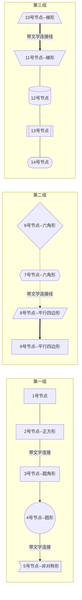

````md

````

#### 横向流程图

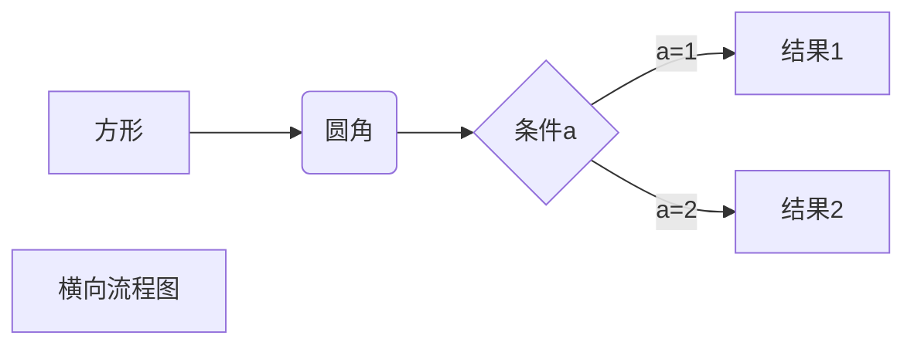

````md

````

#### 竖向流程图

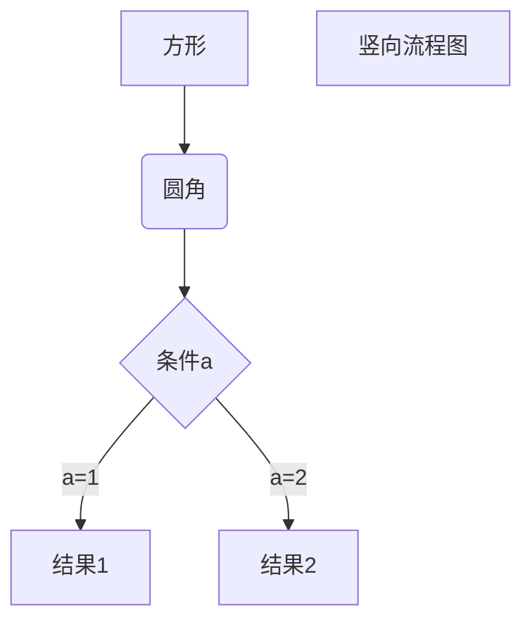

````md

````

### 时序图 Sequence diagram

角色(Actor)、对象(Object)、生命线(LifeLine)、控制焦点(Activation)、消息(Message)、自关联消息、组合片段

类型|描述
---|---
`->`|直线
`-->`| 虚线
`->>`|有箭头的实线
`-->>`|有箭头的虚线

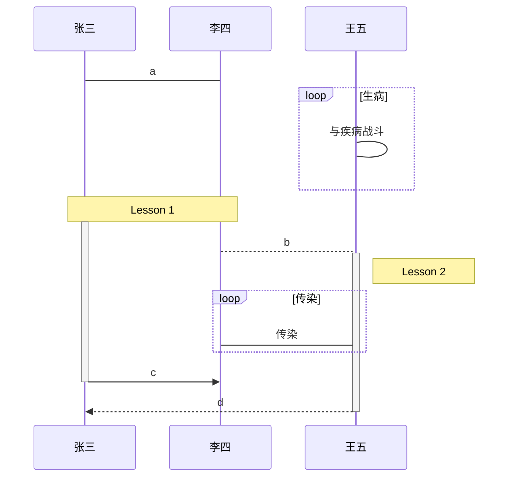

#### 聚焦


````md
​```mermaid
sequenceDiagram
    李雷->>韩梅梅: Hello, what's your name?
    activate 韩梅梅
    韩梅梅-->>李雷: Hello, my name is Hanmeimei!
    deactivate 韩梅梅
​```

简写
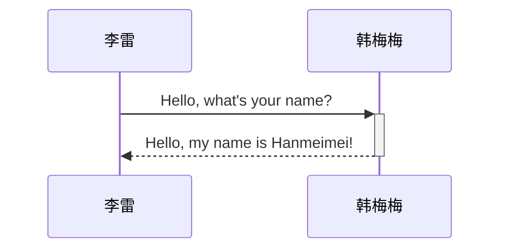
````

#### 备注

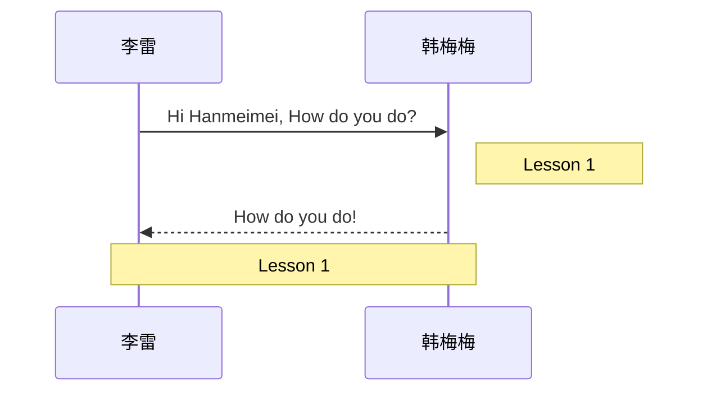

````md

````

#### 逻辑

片段关型|名称|说明
---|---|---
Opt|选项|包含一个可能发生或可能不发生的序列。可以在临界中指定序列发生的条件。
Alt|抉择|包含一个片段列表，这些片段包含备选消息序列。在任何场合下只发生一个序列。可以在每个片段中设置一个临界来指示该片段可以运行的条件。else 的临界指示其他任何临界都不为 True 时应运行的片段。如果所有临界都为 False 并且没有 else，则不执行任何片段。
Loop|循环|片段重复一定次数。可以在临界中指示片段重复的条件。Loop 组合片段具有“Min”和“Max”厦性，已们指示片段可以重复的最小和最大次数-默认值是无限制。
Break|中断|如果为行此片段，则放弃序列的其余部分，可以使用临界来指示发生中断的条件。
Par|并行|并行处理，片段中的事件可以交错.
Critical|关键|用在 Par 或 Seq 片段中。指示此片段中的消息不得与其他消息交错。
Seq|弱顺序|有两个或更多操作数片段．涉及同一生命线的消息心须以片段的顺序发生。如果消息涉及的生命线不同，来自不同片段的消息可能会并行交措。
Strict|强顺序|有两个或重多操作数片段，这些片段心须投给定顺序发生：

##### 循环 Loop

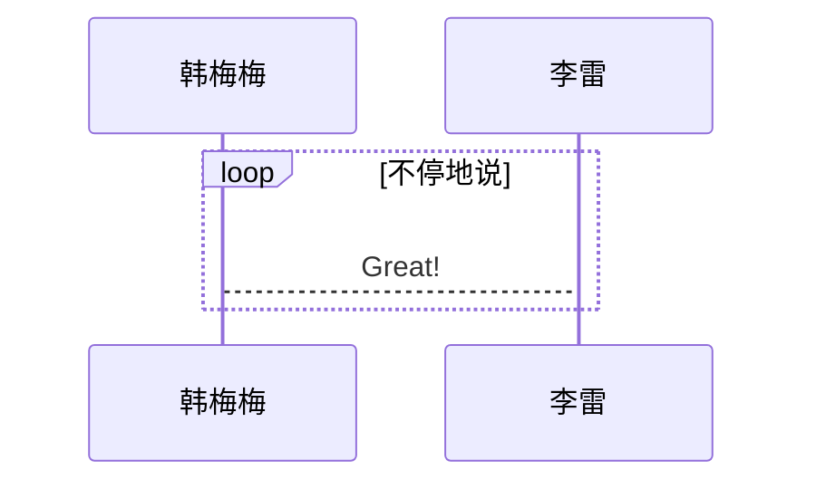

````md

````

##### 抉择 Alt

### 类图 Class diagrams

* 类名称，在类图的最顶端；
* 类属性，在类图的中间层；
* 类方法，在类图的最下层。

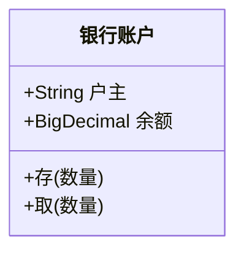

````md

````

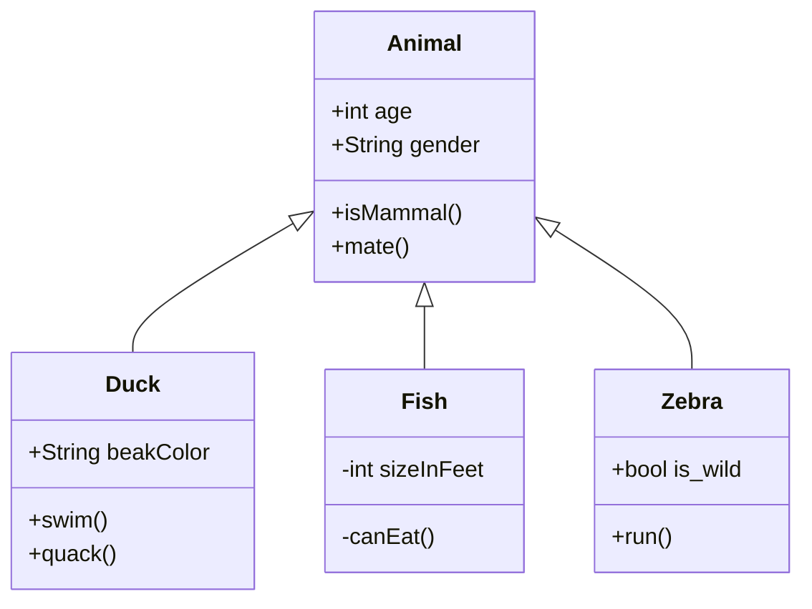

````md

````

### 状态图 State diagrams

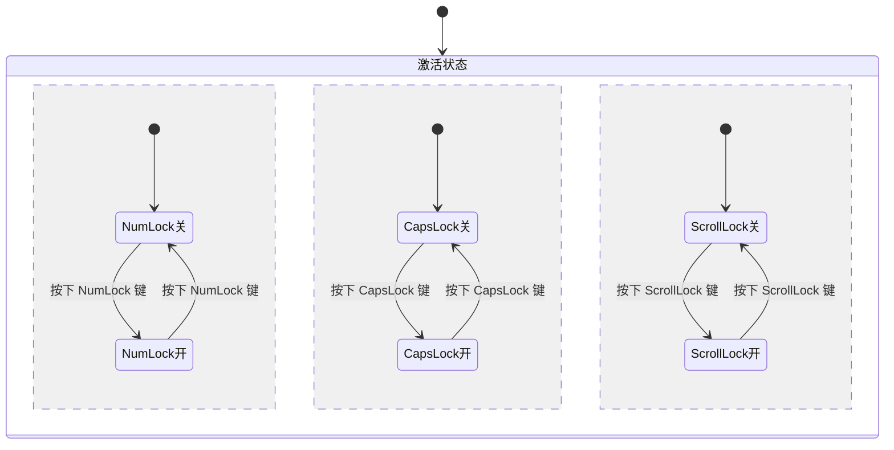

````md

````

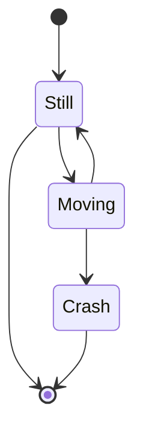

````md
```mermaid
stateDiagram-v2
    [*] --> Still
    Still --> [*]

    Still --> Moving
    Moving --> Still
    Moving --> Crash
    Crash --> [*]
```
````

### 实体关系图 Entity Relationship Diagrams

```mermaid
erDiagram
    CUSTOMER ||--o{ ORDER : places
    ORDER ||--|{ LINE-ITEM : contains
    CUSTOMER }|..|{ DELIVERY-ADDRESS : uses
```

````md
```mermaid
erDiagram
    CUSTOMER ||--o{ ORDER : places
    ORDER ||--|{ LINE-ITEM : contains
    CUSTOMER }|..|{ DELIVERY-ADDRESS : uses
```
````

### 用户旅行图 User Journey Diagram

```mermaid
journey
    title My working day
    section Go to work
      Make tea: 5: Me
      Go upstairs: 3: Me
      Do work: 1: Me, Cat
    section Go home
      Go downstairs: 5: Me
      Sit down: 5: Me
```

````md
```mermaid
journey
    title My working day
    section Go to work
      Make tea: 5: Me
      Go upstairs: 3: Me
      Do work: 1: Me, Cat
    section Go home
      Go downstairs: 5: Me
      Sit down: 5: Me
```
````

### 甘特图 Gantt diagrams

```mermaid
gantt
       dateFormat           :YYYY-MM-DD
       title                :甘特图实例

       section 基本任务
       已完成任务            :done,    des1, 2014-01-06,2014-01-08
       进行中任务            :active,  des2, 2014-01-09, 3d
       未开始任务1           :         des3, after des2, 5d
       未开始任务2           :         des4, after des3, 5d

       section 紧急任务
       已完成的紧急任务 :crit, done, 2014-01-06,24h
       已完成紧急任务1       :crit, done, after des1, 2d
       进行中紧急任务2       :crit, active, 3d
       未开始紧急任务3       :crit, 5d
       未开始一般任务4       :2d
       未开始一般任务5       :1d

       section 文档编写
       进行中文档任务1       :active, a1, after des1, 3d
       未开始文档任务2       :after a1  , 20h
       未开始文档任务3       :doc1, after a1  , 48h

       section 其他部分
       其他任务1            :after doc1, 3d
       其他任务2            :20h
       其他任务3            :48h
```

````md
```mermaid
gantt
       dateFormat           :YYYY-MM-DD
       title                :甘特图实例

       section 基本任务
       已完成任务            :done,    des1, 2014-01-06,2014-01-08
       进行中任务            :active,  des2, 2014-01-09, 3d
       未开始任务1           :         des3, after des2, 5d
       未开始任务2           :         des4, after des3, 5d

       section 紧急任务
       已完成的紧急任务 :crit, done, 2014-01-06,24h
       已完成紧急任务1       :crit, done, after des1, 2d
       进行中紧急任务2       :crit, active, 3d
       未开始紧急任务3       :crit, 5d
       未开始一般任务4       :2d
       未开始一般任务5       :1d

       section 文档编写
       进行中文档任务1       :active, a1, after des1, 3d
       未开始文档任务2       :after a1  , 20h
       未开始文档任务3       :doc1, after a1  , 48h

       section 其他部分
       其他任务1            :after doc1, 3d
       其他任务2            :20h
       其他任务3            :48h
```
````

### 饼图 Pie chart

```mermaid
pie title Pets adopted by volunteers
    "Dogs" : 386
    "Cats" : 85
    "Rats" : 15
```

````md
```mermaid
pie title Pets adopted by volunteers
    "Dogs" : 386
    "Cats" : 85
    "Rats" : 15
```
````

### 需求图 Requirement Diagram

```mermaid
    requirementDiagram

    requirement test_req {
    id: 1
    text: the test text.
    risk: high
    verifymethod: test
    }

    element test_entity {
    type: simulation
    }

    test_entity - satisfies -> test_req
```

````md
```mermaid
requirementDiagram

    requirement test_req {
    id: 1
    text: the test text.
    risk: high
    verifymethod: test
    }

    element test_entity {
    type: simulation
    }

    test_entity - satisfies -> test_req
```
````

```mermaid
requirementDiagram

    requirement test_req {
    id: 1
    text: the test text.
    risk: high
    verifymethod: test
    }

    functionalRequirement test_req2 {
    id: 1.1
    text: the second test text.
    risk: low
    verifymethod: inspection
    }

    performanceRequirement test_req3 {
    id: 1.2
    text: the third test text.
    risk: medium
    verifymethod: demonstration
    }

    interfaceRequirement test_req4 {
    id: 1.2.1
    text: the fourth test text.
    risk: medium
    verifymethod: analysis
    }

    physicalRequirement test_req5 {
    id: 1.2.2
    text: the fifth test text.
    risk: medium
    verifymethod: analysis
    }

    designConstraint test_req6 {
    id: 1.2.3
    text: the sixth test text.
    risk: medium
    verifymethod: analysis
    }

    element test_entity {
    type: simulation
    }

    element test_entity2 {
    type: word doc
    docRef: reqs/test_entity
    }

    element test_entity3 {
    type: "test suite"
    docRef: github.com/all_the_tests
    }


    test_entity - satisfies -> test_req2
    test_req - traces -> test_req2
    test_req - contains -> test_req3
    test_req3 - contains -> test_req4
    test_req4 - derives -> test_req5
    test_req5 - refines -> test_req6
    test_entity3 - verifies -> test_req5
    test_req <- copies - test_entity2
```

````md
```mermaid
requirementDiagram

    requirement test_req {
    id: 1
    text: the test text.
    risk: high
    verifymethod: test
    }

    functionalRequirement test_req2 {
    id: 1.1
    text: the second test text.
    risk: low
    verifymethod: inspection
    }

    performanceRequirement test_req3 {
    id: 1.2
    text: the third test text.
    risk: medium
    verifymethod: demonstration
    }

    interfaceRequirement test_req4 {
    id: 1.2.1
    text: the fourth test text.
    risk: medium
    verifymethod: analysis
    }

    physicalRequirement test_req5 {
    id: 1.2.2
    text: the fifth test text.
    risk: medium
    verifymethod: analysis
    }

    designConstraint test_req6 {
    id: 1.2.3
    text: the sixth test text.
    risk: medium
    verifymethod: analysis
    }

    element test_entity {
    type: simulation
    }

    element test_entity2 {
    type: word doc
    docRef: reqs/test_entity
    }

    element test_entity3 {
    type: "test suite"
    docRef: github.com/all_the_tests
    }


    test_entity - satisfies -> test_req2
    test_req - traces -> test_req2
    test_req - contains -> test_req3
    test_req3 - contains -> test_req4
    test_req4 - derives -> test_req5
    test_req5 - refines -> test_req6
    test_entity3 - verifies -> test_req5
    test_req <- copies - test_entity2
```
````

### Git图 Gitgraph Diagrams

```mermaid
 gitGraph
       commit
       commit
       branch develop
       checkout develop
       commit
       commit
       checkout main
       merge develop
       commit
       commit
```

````md
```mermaid
 gitGraph
       commit
       commit
       branch develop
       checkout develop
       commit
       commit
       checkout main
       merge develop
       commit
       commit
```
````

### C4图 C4 Diagrams

实验性，未正式发布

## 短代码表情

完整的列表可在此处找到：[表情符号备忘单](https://www.webpagefx.com/tools/emoji-cheat-sheet/)

**人**

:bowtie:
:smile:
:laughing:
:blush:
:smiley:
:relaxed:
:smirk:
:heart_eyes:
:kissing_heart:
:kissing_closed_eyes:
:flushed:
:relieved:
:satisfied:
:grin:
:wink:
:stuck_out_tongue_winking_eye:
:stuck_out_tongue_closed_eyes:
:grinning:
:kissing:
:kissing_smiling_eyes:
:stuck_out_tongue:
:sleeping:
:worried:
:frowning:
:anguished:
:open_mouth:
:grimacing:
:confused:
:hushed:
:expressionless:
:unamused:
:sweat_smile:
:sweat:
:disappointed_relieved:
:weary:
:pensive:
:disappointed:
:confounded:
:fearful:
:cold_sweat:
:persevere:
:cry:
:sob:
:joy:
:astonished:
:scream:
:neckbeard:
:tired_face:
:angry:
:rage:
:triumph:
:sleepy:
:yum:
:mask:
:sunglasses:
:dizzy_face:
:imp:
:smiling_imp:
:neutral_face:
:no_mouth:
:innocent:
:alien:
:yellow_heart:
:blue_heart:
:purple_heart:
:heart:
:green_heart:
:broken_heart:
:heartbeat:
:heartpulse:
:two_hearts:
:revolving_hearts:
:cupid:
:sparkling_heart:
:sparkles:
:star:
:star2:
:dizzy:
:boom:
:collision:
:anger:
:exclamation:
:question:
:grey_exclamation:
:grey_question:
:zzz:
:dash:
:sweat_drops:
:notes:
:musical_note:
:fire:
:hankey:
:poop:
:shit:
:thumbsup:
:thumbsdown:
:ok_hand:
:punch:
:facepunch:
:fist:
:v:
:wave:
:hand:
:raised_hand:
:open_hands:
:point_up:
:point_down:
:point_left:
:point_right:
:raised_hands:
:pray:
:point_up_2:
:clap:
:muscle:
:metal:
:fu:
:runner:
:running:
:couple:
:family:
:two_men_holding_hands:
:two_women_holding_hands:
:dancer:
:dancers:
:ok_woman:
:no_good:
:information_desk_person:
:raising_hand:
:bride_with_veil:
:person_with_pouting_face:
:person_frowning:
:bow:
:couplekiss:
:couple_with_heart:
:massage:
:haircut:
:nail_care:
:boy:
:girl:
:woman:
:man:
:baby:
:older_woman:
:older_man:
:person_with_blond_hair:
:man_with_gua_pi_mao:
:man_with_turban:
:construction_worker:
:cop:
:angel:
:princess:
:smiley_cat:
:smile_cat:
:heart_eyes_cat:
:kissing_cat:
:smirk_cat:
:scream_cat:
:crying_cat_face:
:joy_cat:
:pouting_cat:
:japanese_ogre:
:japanese_goblin:
:see_no_evil:
:hear_no_evil:
:speak_no_evil:
:guardsman:
:skull:
:feet:
:lips:
:kiss:
:droplet:
:ear:
:eyes:
:nose:
:tongue:
:love_letter:
:bust_in_silhouette:
:busts_in_silhouette:
:speech_balloon:
:thought_balloon:
:feelsgood:
:finnadie:
:goberserk:
:godmode:
:hurtrealbad:
:rage1:
:rage2:
:rage3:
:rage4:
:suspect:
:trollface:

**自然界**

:sunny:
:umbrella:
:cloud:
:snowflake:
:snowman:
:zap:
:cyclone:
:foggy:
:ocean:
:cat:
:dog:
:mouse:
:hamster:
:rabbit:
:wolf:
:frog:
:tiger:
:koala:
:bear:
:pig:
:pig_nose:
:cow:
:boar:
:monkey_face:
:monkey:
:horse:
:racehorse:
:camel:
:sheep:
:elephant:
:panda_face:
:snake:
:bird:
:baby_chick:
:hatched_chick:
:hatching_chick:
:chicken:
:penguin:
:turtle:
:bug:
:honeybee:
:ant:
:beetle:
:snail:
:octopus:
:tropical_fish:
:fish:
:whale:
:whale2:
:dolphin:
:cow2:
:ram:
:rat:
:water_buffalo:
:tiger2:
:rabbit2:
:dragon:
:goat:
:rooster:
:dog2:
:pig2:
:mouse2:
:ox:
:dragon_face:
:blowfish:
:crocodile:
:dromedary_camel:
:leopard:
:cat2:
:poodle:
:paw_prints:
:bouquet:
:cherry_blossom:
:tulip:
:four_leaf_clover:
:rose:
:sunflower:
:hibiscus:
:maple_leaf:
:leaves:
:fallen_leaf:
:herb:
:mushroom:
:cactus:
:palm_tree:
:evergreen_tree:
:deciduous_tree:
:chestnut:
:seedling:
:blossom:
:ear_of_rice:
:shell:
:globe_with_meridians:
:sun_with_face:
:full_moon_with_face:
:new_moon_with_face:
:new_moon:
:waxing_crescent_moon:
:first_quarter_moon:
:waxing_gibbous_moon:
:full_moon:
:waning_gibbous_moon:
:last_quarter_moon:
:waning_crescent_moon:
:last_quarter_moon_with_face:
:first_quarter_moon_with_face:
:crescent_moon:
:earth_africa:
:earth_americas:
:earth_asia:
:volcano:
:milky_way:
:partly_sunny:
:octocat:
:squirrel:

**对象**

:bamboo:
:gift_heart:
:dolls:
:school_satchel:
:mortar_board:
:flags:
:fireworks:
:sparkler:
:wind_chime:
:rice_scene:
:jack_o_lantern:
:ghost:
:santa:
:christmas_tree:
:gift:
:bell:
:no_bell:
:tanabata_tree:
:tada:
:confetti_ball:
:balloon:
:crystal_ball:
:cd:
:dvd:
:floppy_disk:
:camera:
:video_camera:
:movie_camera:
:computer:
:tv:
:iphone:
:phone:
:telephone:
:telephone_receiver:
:pager:
:fax:
:minidisc:
:vhs:
:sound:
:speaker:
:mute:
:loudspeaker:
:mega:
:hourglass:
:hourglass_flowing_sand:
:alarm_clock:
:watch:
:radio:
:satellite:
:loop:
:mag:
:mag_right:
:unlock:
:lock:
:lock_with_ink_pen:
:closed_lock_with_key:
:key:
:bulb:
:flashlight:
:high_brightness:
:low_brightness:
:electric_plug:
:battery:
:calling:
:email:
:mailbox:
:postbox:
:bath:
:bathtub:
:shower:
:toilet:
:wrench:
:nut_and_bolt:
:hammer:
:seat:
:moneybag:
:yen:
:dollar:
:pound:
:euro:
:credit_card:
:money_with_wings:
:inbox_tray:
:outbox_tray:
:envelope:
:incoming_envelope:
:postal_horn:
:mailbox_closed:
:mailbox_with_mail:
:mailbox_with_no_mail:
:package:
:door:
:smoking:
:bomb:
:gun:
:hocho:
:pill:
:syringe:
:page_facing_up:
:page_with_curl:
:bookmark_tabs:
:bar_chart:
:chart_with_upwards_trend:
:chart_with_downwards_trend:
:scroll:
:clipboard:
:calendar:
:date:
:card_index:
:file_folder:
:open_file_folder:
:scissors:
:pushpin:
:paperclip:
:black_nib:
:pencil2:
:straight_ruler:
:triangular_ruler:
:closed_book:
:green_book:
:blue_book:
:orange_book:
:notebook:
:notebook_with_decorative_cover:
:ledger:
:books:
:bookmark:
:name_badge:
:microscope:
:telescope:
:newspaper:
:football:
:basketball:
:soccer:
:baseball:
:tennis:
:8ball:
:rugby_football:
:bowling:
:golf:
:mountain_bicyclist:
:bicyclist:
:horse_racing:
:snowboarder:
:swimmer:
:surfer:
:ski:
:spades:
:hearts:
:clubs:
:diamonds:
:gem:
:ring:
:trophy:
:musical_score:
:musical_keyboard:
:violin:
:space_invader:
:video_game:
:black_joker:
:flower_playing_cards:
:game_die:
:dart:
:mahjong:
:clapper:
:memo:
:pencil:
:book:
:art:
:microphone:
:headphones:
:trumpet:
:saxophone:
:guitar:
:shoe:
:sandal:
:high_heel:
:lipstick:
:boot:
:shirt:
:tshirt:
:necktie:
:womans_clothes:
:dress:
:running_shirt_with_sash:
:jeans:
:kimono:
:bikini:
:ribbon:
:tophat:
:crown:
:womans_hat:
:mans_shoe:
:closed_umbrella:
:briefcase:
:handbag:
:pouch:
:purse:
:eyeglasses:
:fishing_pole_and_fish:
:coffee:
:tea:
:sake:
:baby_bottle:
:beer:
:beers:
:cocktail:
:tropical_drink:
:wine_glass:
:fork_and_knife:
:pizza:
:hamburger:
:fries:
:poultry_leg:
:meat_on_bone:
:spaghetti:
:curry:
:fried_shrimp:
:bento:
:sushi:
:fish_cake:
:rice_ball:
:rice_cracker:
:rice:
:ramen:
:stew:
:oden:
:dango:
:egg:
:bread:
:doughnut:
:custard:
:icecream:
:ice_cream:
:shaved_ice:
:birthday:
:cake:
:cookie:
:chocolate_bar:
:candy:
:lollipop:
:honey_pot:
:apple:
:green_apple:
:tangerine:
:lemon:
:cherries:
:grapes:
:watermelon:
:strawberry:
:peach:
:melon:
:banana:
:pear:
:pineapple:
:sweet_potato:
:eggplant:
:tomato:
:corn:

**地方**

:house:
:house_with_garden:
:school:
:office:
:post_office:
:hospital:
:bank:
:convenience_store:
:love_hotel:
:hotel:
:wedding:
:church:
:department_store:
:european_post_office:
:city_sunrise:
:city_sunset:
:japanese_castle:
:european_castle:
:tent:
:factory:
:tokyo_tower:
:japan:
:mount_fuji:
:sunrise_over_mountains:
:sunrise:
:stars:
:statue_of_liberty:
:bridge_at_night:
:carousel_horse:
:rainbow:
:ferris_wheel:
:fountain:
:roller_coaster:
:ship:
:speedboat:
:boat:
:sailboat:
:rowboat:
:anchor:
:rocket:
:airplane:
:helicopter:
:steam_locomotive:
:tram:
:mountain_railway:
:bike:
:aerial_tramway:
:suspension_railway:
:mountain_cableway:
:tractor:
:blue_car:
:oncoming_automobile:
:car:
:red_car:
:taxi:
:oncoming_taxi:
:articulated_lorry:
:bus:
:oncoming_bus:
:rotating_light:
:police_car:
:oncoming_police_car:
:fire_engine:
:ambulance:
:minibus:
:truck:
:train:
:station:
:train2:
:bullettrain_front:
:bullettrain_side:
:light_rail:
:monorail:
:railway_car:
:trolleybus:
:ticket:
:fuelpump:
:vertical_traffic_light:
:traffic_light:
:warning:
:construction:
:beginner:
:atm:
:slot_machine:
:busstop:
:barber:
:hotsprings:
:checkered_flag:
:crossed_flags:
:izakaya_lantern:
:moyai:
:circus_tent:
:performing_arts:
:round_pushpin:
:triangular_flag_on_post:
:jp:
:kr:
:cn:
:us:
:fr:
:es:
:it:
:ru:
:gb:
:uk:
:de:

**符号**

:one:
:two:
:three:
:four:
:five:
:six:
:seven:
:eight:
:nine:
:keycap_ten:
:1234:
:zero:
:hash:
:symbols:
:arrow_backward:
:arrow_down:
:arrow_forward:
:arrow_left:
:capital_abcd:
:abcd:
:abc:
:arrow_lower_left:
:arrow_lower_right:
:arrow_right:
:arrow_up:
:arrow_upper_left:
:arrow_upper_right:
:arrow_double_down:
:arrow_double_up:
:arrow_down_small:
:arrow_heading_down:
:arrow_heading_up:
:leftwards_arrow_with_hook:
:arrow_right_hook:
:left_right_arrow:
:arrow_up_down:
:arrow_up_small:
:arrows_clockwise:
:arrows_counterclockwise:
:rewind:
:fast_forward:
:information_source:
:ok:
:twisted_rightwards_arrows:
:repeat:
:repeat_one:
:new:
:top:
:up:
:cool:
:free:
:ng:
:cinema:
:koko:
:signal_strength:
:u5272:
:u5408:
:u55b6:
:u6307:
:u6708:
:u6709:
:u6e80:
:u7121:
:u7533:
:u7a7a:
:u7981:
:sa:
:restroom:
:mens:
:womens:
:baby_symbol:
:no_smoking:
:parking:
:wheelchair:
:metro:
:baggage_claim:
:accept:
:wc:
:potable_water:
:put_litter_in_its_place:
:secret:
:congratulations:
:m:
:passport_control:
:left_luggage:
:customs:
:ideograph_advantage:
:cl:
:sos:
:id:
:no_entry_sign:
:underage:
:no_mobile_phones:
:do_not_litter:
:no_bicycles:
:no_pedestrians:
:children_crossing:
:no_entry:
:eight_spoked_asterisk:
:sparkle:
:eight_pointed_black_star:
:heart_decoration:
:vs:
:vibration_mode:
:mobile_phone_off:
:chart:
:currency_exchange:
:aries:
:taurus:
:gemini:
:cancer:
:leo:
:virgo:
:libra:
:scorpius:
:sagittarius:
:capricorn:
:aquarius:
:pisces:
:ophiuchus:
:six_pointed_star:
:negative_squared_cross_mark:
:a:
:b:
:ab:
:o2:
:diamond_shape_with_a_dot_inside:
:recycle:
:end:
:back:
:on:
:soon:
:clock1:
:clock130:
:clock10:
:clock1030:
:clock11:
:clock1130:
:clock12:
:clock1230:
:clock2:
:clock230:
:clock3:
:clock330:
:clock4:
:clock430:
:clock5:
:clock530:
:clock6:
:clock630:
:clock7:
:clock730:
:clock8:
:clock830:
:clock9:
:clock930:
:heavy_dollar_sign:
:copyright:
:registered:
:tm:
:x:
:heavy_exclamation_mark:
:bangbang:
:interrobang:
:o:
:heavy_multiplication_x:
:heavy_plus_sign:
:heavy_minus_sign:
:heavy_division_sign:
:white_flower:
:100:
:heavy_check_mark:
:ballot_box_with_check:
:radio_button:
:link:
:curly_loop:
:wavy_dash:
:part_alternation_mark:
:trident:
:black_small_square:
:white_small_square:
:black_medium_small_square:
:white_medium_small_square:
:black_medium_square:
:white_medium_square:
:black_large_square:
:white_large_square:
:white_check_mark:
:black_square_button:
:white_square_button:
:black_circle:
:white_circle:
:red_circle:
:large_blue_circle:
:large_blue_diamond:
:large_orange_diamond:
:small_blue_diamond:
:small_orange_diamond:
:small_red_triangle:
:small_red_triangle_down:
:shipit:
