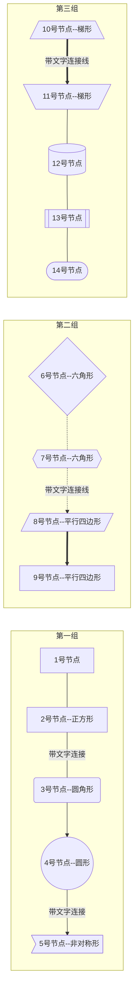
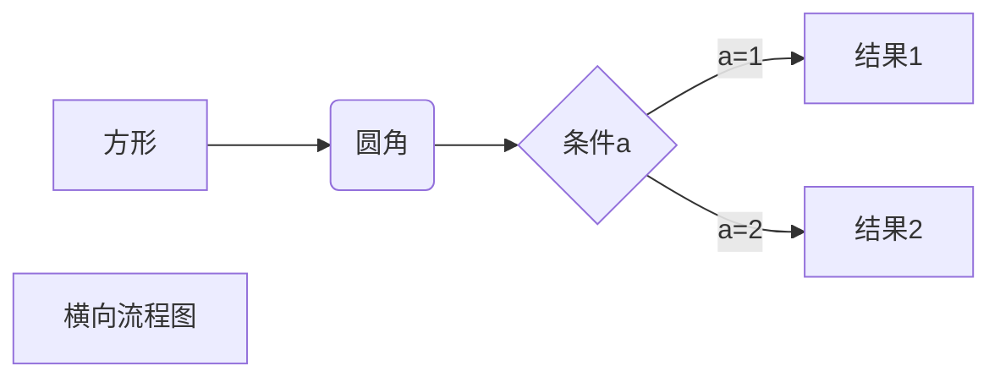
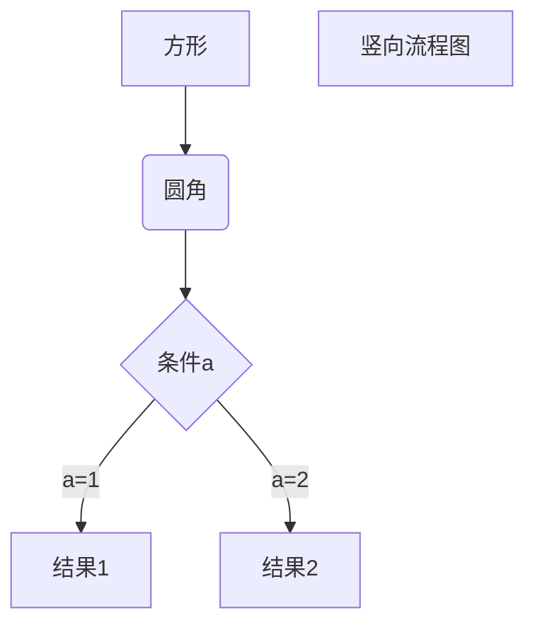
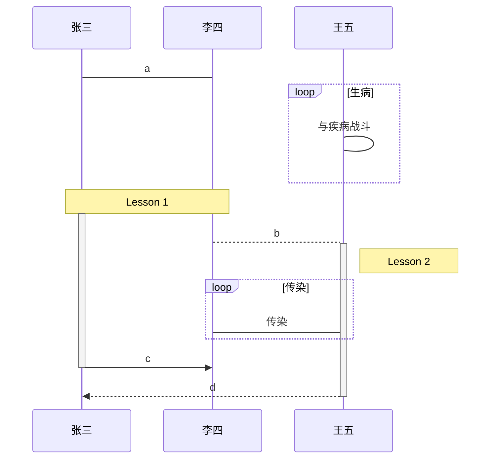
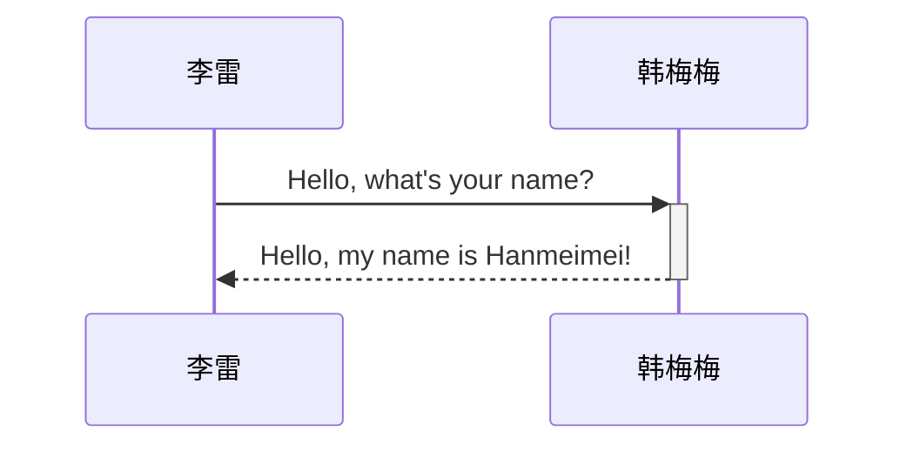
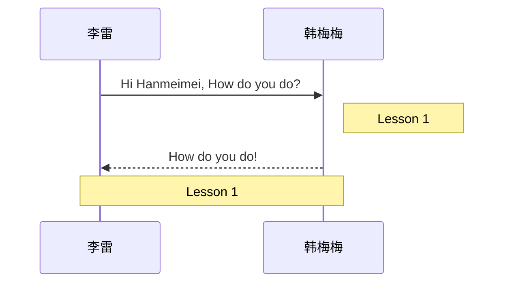
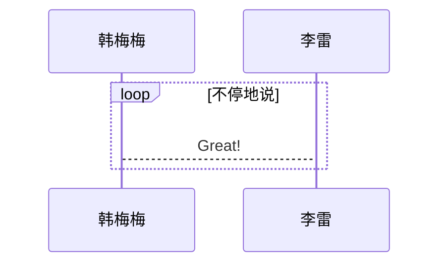
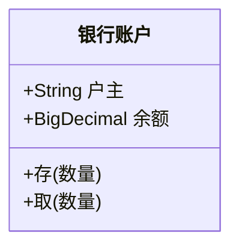
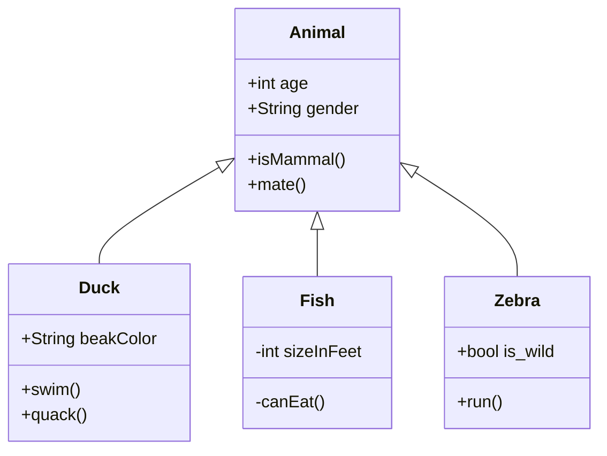
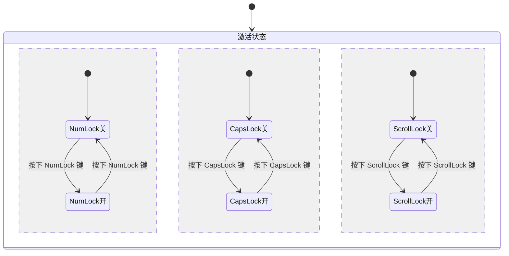

# Mermaid.js

Mermaid 允许您使用文本和代码创建图表和可视化效果。

* [文档](https://mermaid-js.github.io/mermaid/#/)
* [Github](https://github.com/mermaid-js/mermaid)
* [官网](http://mermaid.js.org/)

使用方法：

````md
```mermaid
<!-- code -->
```
````

## 流程图

标志|方向
---|---
TB|top bottom - 从上到下
BT|bottom top - 从下到上
RL|right left - 从右到左
LR|left right - 从左到右
TD|等同于 TB


````md

````

### 横向流程图



````md

````

### 竖向流程图



````md

````

## 时序图 Sequence diagram

角色(Actor)、对象(Object)、生命线(LifeLine)、控制焦点(Activation)、消息(Message)、自关联消息、组合片段

类型|描述
---|---
`->`|直线
`-->`| 虚线
`->>`|有箭头的实线
`-->>`|有箭头的虚线



### 聚焦


````md
​```mermaid
sequenceDiagram
    李雷->>韩梅梅: Hello, what's your name?
    activate 韩梅梅
    韩梅梅-->>李雷: Hello, my name is Hanmeimei!
    deactivate 韩梅梅
​```

简写

````

### 备注



````md

````

### 逻辑

片段关型|名称|说明
---|---|---
Opt|选项|包含一个可能发生或可能不发生的序列。可以在临界中指定序列发生的条件。
Alt|抉择|包含一个片段列表，这些片段包含备选消息序列。在任何场合下只发生一个序列。可以在每个片段中设置一个临界来指示该片段可以运行的条件。else 的临界指示其他任何临界都不为 True 时应运行的片段。如果所有临界都为 False 并且没有 else，则不执行任何片段。
Loop|循环|片段重复一定次数。可以在临界中指示片段重复的条件。Loop 组合片段具有“Min”和“Max”厦性，已们指示片段可以重复的最小和最大次数-默认值是无限制。
Break|中断|如果为行此片段，则放弃序列的其余部分，可以使用临界来指示发生中断的条件。
Par|并行|并行处理，片段中的事件可以交错.
Critical|关键|用在 Par 或 Seq 片段中。指示此片段中的消息不得与其他消息交错。
Seq|弱顺序|有两个或更多操作数片段．涉及同一生命线的消息心须以片段的顺序发生。如果消息涉及的生命线不同，来自不同片段的消息可能会并行交措。
Strict|强顺序|有两个或重多操作数片段，这些片段心须投给定顺序发生：

#### 循环 Loop



````md

````

#### 抉择 Alt

## 类图 Class diagrams

* 类名称，在类图的最顶端；
* 类属性，在类图的中间层；
* 类方法，在类图的最下层。



````md

````



````md

````

## 状态图 State diagrams



````md

````

```mermaid
stateDiagram-v2
    [*] --> Still
    Still --> [*]

    Still --> Moving
    Moving --> Still
    Moving --> Crash
    Crash --> [*]
```

````md
```mermaid
stateDiagram-v2
    [*] --> Still
    Still --> [*]

    Still --> Moving
    Moving --> Still
    Moving --> Crash
    Crash --> [*]
```
````

## 实体关系图 Entity Relationship Diagrams

```mermaid
erDiagram
    CUSTOMER ||--o{ ORDER : places
    ORDER ||--|{ LINE-ITEM : contains
    CUSTOMER }|..|{ DELIVERY-ADDRESS : uses
```

````md
```mermaid
erDiagram
    CUSTOMER ||--o{ ORDER : places
    ORDER ||--|{ LINE-ITEM : contains
    CUSTOMER }|..|{ DELIVERY-ADDRESS : uses
```
````

## 用户旅行图 User Journey Diagram

```mermaid
journey
    title My working day
    section Go to work
      Make tea: 5: Me
      Go upstairs: 3: Me
      Do work: 1: Me, Cat
    section Go home
      Go downstairs: 5: Me
      Sit down: 5: Me
```

````md
```mermaid
journey
    title My working day
    section Go to work
      Make tea: 5: Me
      Go upstairs: 3: Me
      Do work: 1: Me, Cat
    section Go home
      Go downstairs: 5: Me
      Sit down: 5: Me
```
````

## 甘特图 Gantt diagrams

```mermaid
gantt
       dateFormat           :YYYY-MM-DD
       title                :甘特图实例

       section 基本任务
       已完成任务            :done,    des1, 2014-01-06,2014-01-08
       进行中任务            :active,  des2, 2014-01-09, 3d
       未开始任务1           :         des3, after des2, 5d
       未开始任务2           :         des4, after des3, 5d

       section 紧急任务
       已完成的紧急任务 :crit, done, 2014-01-06,24h
       已完成紧急任务1       :crit, done, after des1, 2d
       进行中紧急任务2       :crit, active, 3d
       未开始紧急任务3       :crit, 5d
       未开始一般任务4       :2d
       未开始一般任务5       :1d

       section 文档编写
       进行中文档任务1       :active, a1, after des1, 3d
       未开始文档任务2       :after a1  , 20h
       未开始文档任务3       :doc1, after a1  , 48h

       section 其他部分
       其他任务1            :after doc1, 3d
       其他任务2            :20h
       其他任务3            :48h
```

````md
```mermaid
gantt
       dateFormat           :YYYY-MM-DD
       title                :甘特图实例

       section 基本任务
       已完成任务            :done,    des1, 2014-01-06,2014-01-08
       进行中任务            :active,  des2, 2014-01-09, 3d
       未开始任务1           :         des3, after des2, 5d
       未开始任务2           :         des4, after des3, 5d

       section 紧急任务
       已完成的紧急任务 :crit, done, 2014-01-06,24h
       已完成紧急任务1       :crit, done, after des1, 2d
       进行中紧急任务2       :crit, active, 3d
       未开始紧急任务3       :crit, 5d
       未开始一般任务4       :2d
       未开始一般任务5       :1d

       section 文档编写
       进行中文档任务1       :active, a1, after des1, 3d
       未开始文档任务2       :after a1  , 20h
       未开始文档任务3       :doc1, after a1  , 48h

       section 其他部分
       其他任务1            :after doc1, 3d
       其他任务2            :20h
       其他任务3            :48h
```
````

## 饼图 Pie chart

```mermaid
pie title Pets adopted by volunteers
    "Dogs" : 386
    "Cats" : 85
    "Rats" : 15
```

````md
```mermaid
pie title Pets adopted by volunteers
    "Dogs" : 386
    "Cats" : 85
    "Rats" : 15
```
````

## 需求图 Requirement Diagram

```mermaid
    requirementDiagram

    requirement test_req {
    id: 1
    text: the test text.
    risk: high
    verifymethod: test
    }

    element test_entity {
    type: simulation
    }

    test_entity - satisfies -> test_req
```

````md
```mermaid
requirementDiagram

    requirement test_req {
    id: 1
    text: the test text.
    risk: high
    verifymethod: test
    }

    element test_entity {
    type: simulation
    }

    test_entity - satisfies -> test_req
```
````

```mermaid
requirementDiagram

    requirement test_req {
    id: 1
    text: the test text.
    risk: high
    verifymethod: test
    }

    functionalRequirement test_req2 {
    id: 1.1
    text: the second test text.
    risk: low
    verifymethod: inspection
    }

    performanceRequirement test_req3 {
    id: 1.2
    text: the third test text.
    risk: medium
    verifymethod: demonstration
    }

    interfaceRequirement test_req4 {
    id: 1.2.1
    text: the fourth test text.
    risk: medium
    verifymethod: analysis
    }

    physicalRequirement test_req5 {
    id: 1.2.2
    text: the fifth test text.
    risk: medium
    verifymethod: analysis
    }

    designConstraint test_req6 {
    id: 1.2.3
    text: the sixth test text.
    risk: medium
    verifymethod: analysis
    }

    element test_entity {
    type: simulation
    }

    element test_entity2 {
    type: word doc
    docRef: reqs/test_entity
    }

    element test_entity3 {
    type: "test suite"
    docRef: github.com/all_the_tests
    }


    test_entity - satisfies -> test_req2
    test_req - traces -> test_req2
    test_req - contains -> test_req3
    test_req3 - contains -> test_req4
    test_req4 - derives -> test_req5
    test_req5 - refines -> test_req6
    test_entity3 - verifies -> test_req5
    test_req <- copies - test_entity2
```

````md
```mermaid
requirementDiagram

    requirement test_req {
    id: 1
    text: the test text.
    risk: high
    verifymethod: test
    }

    functionalRequirement test_req2 {
    id: 1.1
    text: the second test text.
    risk: low
    verifymethod: inspection
    }

    performanceRequirement test_req3 {
    id: 1.2
    text: the third test text.
    risk: medium
    verifymethod: demonstration
    }

    interfaceRequirement test_req4 {
    id: 1.2.1
    text: the fourth test text.
    risk: medium
    verifymethod: analysis
    }

    physicalRequirement test_req5 {
    id: 1.2.2
    text: the fifth test text.
    risk: medium
    verifymethod: analysis
    }

    designConstraint test_req6 {
    id: 1.2.3
    text: the sixth test text.
    risk: medium
    verifymethod: analysis
    }

    element test_entity {
    type: simulation
    }

    element test_entity2 {
    type: word doc
    docRef: reqs/test_entity
    }

    element test_entity3 {
    type: "test suite"
    docRef: github.com/all_the_tests
    }


    test_entity - satisfies -> test_req2
    test_req - traces -> test_req2
    test_req - contains -> test_req3
    test_req3 - contains -> test_req4
    test_req4 - derives -> test_req5
    test_req5 - refines -> test_req6
    test_entity3 - verifies -> test_req5
    test_req <- copies - test_entity2
```
````

## Git图 Gitgraph Diagrams

```mermaid
 gitGraph
       commit
       commit
       branch develop
       checkout develop
       commit
       commit
       checkout main
       merge develop
       commit
       commit
```

````md
```mermaid
 gitGraph
       commit
       commit
       branch develop
       checkout develop
       commit
       commit
       checkout main
       merge develop
       commit
       commit
```
````
## 思维导图

```mermaid
mindmap
  root((mindmap))
    Origins
      Long history
      ::icon(fa fa-book)
      Popularisation
        British popular psychology author Tony Buzan
    Research
      On effectiveness<br/>and features
      On Automatic creation
        Uses
            Creative techniques
            Strategic planning
            Argument mapping
    Tools
      Pen and paper
      Mermaid
```
